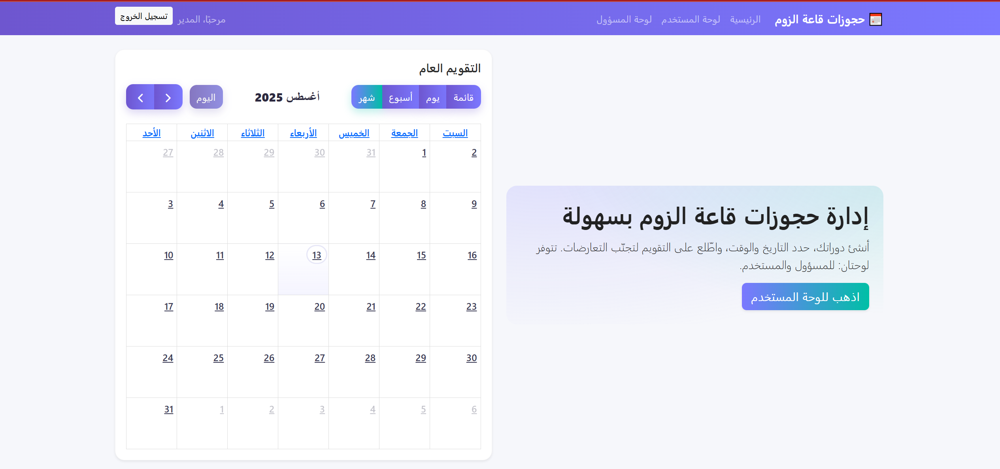
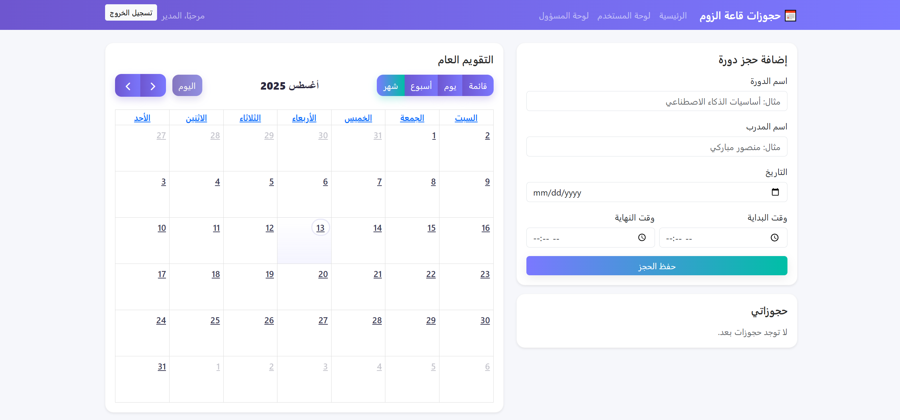

# 📅 Zoom Hall Booking

مشروع **حجز قاعة زوم** هو تطبيق ويب مبني باستخدام **Flask** و **PostgreSQL**، يتيح للمستخدمين حجز قاعات اجتماعات عبر الإنترنت بسهولة، مع إدارة مواعيدهم بشكل منظم واحترافي.

---

## ✨ المميزات
- تسجيل المستخدمين وإدارة الحسابات.
- حجز قاعة زوم مع تحديد الوقت والتاريخ.
- عرض الحجوزات الحالية والقادمة.
- دعم قاعدة بيانات PostgreSQL.
- إمكانية النشر على منصة Render أو أي منصة تدعم Python.

---

## 🛠 المتطلبات
- **Python 3.11** أو أحدث.
- مكتبات المشروع (موجودة في ملف `requirements.txt`).
- قاعدة بيانات PostgreSQL (محلية أو مستضافة على الإنترنت مثل Render).

---

## 📦 التثبيت والتشغيل محليًا

1. **استنساخ المشروع:**
    ```bash
    git clone https://github.com/USERNAME/zoom-booking.git
    cd zoom-booking
    ```

2. **إنشاء بيئة افتراضية وتثبيت المتطلبات:**
    - على أنظمة **Linux/Mac**:
      ```bash
      python -m venv venv
      source venv/bin/activate
      pip install -r requirements.txt
      ```
    - على نظام **Windows**:
      ```bash
      python -m venv venv
      venv\Scripts\activate
      pip install -r requirements.txt
      ```

3. **تشغيل التطبيق:**
    ```bash
    python app.py
    ```

---

## 🌐 النشر على Render
1. اربط المشروع بمستودع GitHub الخاص بك.
2. أضف متغير البيئة:
    ```
    DATABASE_URL = رابط قاعدة بيانات PostgreSQL
    ```
3. حدد إصدار Python المناسب (يفضل **3.11**).
4. اضغط **Deploy**.

---

## 🖼 صور توضيحية
| الصفحة الرئيسية | صفحة تسجيل الدخول | صفحة الحجز |
|----------------|-------------------|------------|
|  |  |  |

---

## 🔌 API Endpoints (مثال)
| Endpoint | الوصف | طريقة الطلب |
|----------|-------|-------------|
| `/api/bookings` | جلب جميع الحجوزات | GET |
| `/api/bookings` | إنشاء حجز جديد | POST |
| `/api/bookings/<id>` | تعديل حجز موجود | PUT |
| `/api/bookings/<id>` | حذف حجز | DELETE |

---

## 👤 المؤلف
تم الانشاء و التطوير بواسطة **[منصور مباركي / تبوك]**

---

## 📄 الترخيص
المشروع مفتوح المصدر ويمكنك التعديل عليه بحرية.
